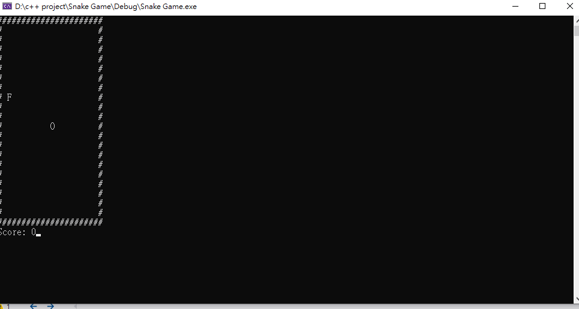

# Snake-Game

This is a simple "Snake Game" by C++, here're the rules:

1. press w to move the snake upward
2. press s to move the snake downward
3. press a to move the snake leftward
4. press d to move the snake rightward
5. press x to end the game
6. the snake can pass through the walls
7. when the head bump into tail, the game will be over

The idea is not my original, all credit to the creator of this youtube video:
https://www.youtube.com/watch?v=E_-lMZDi7Uw

### Sample gameplay

